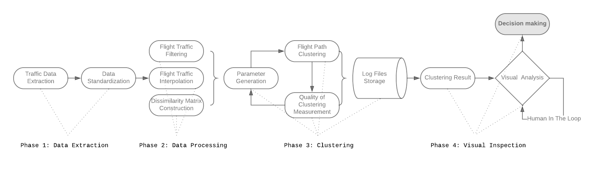
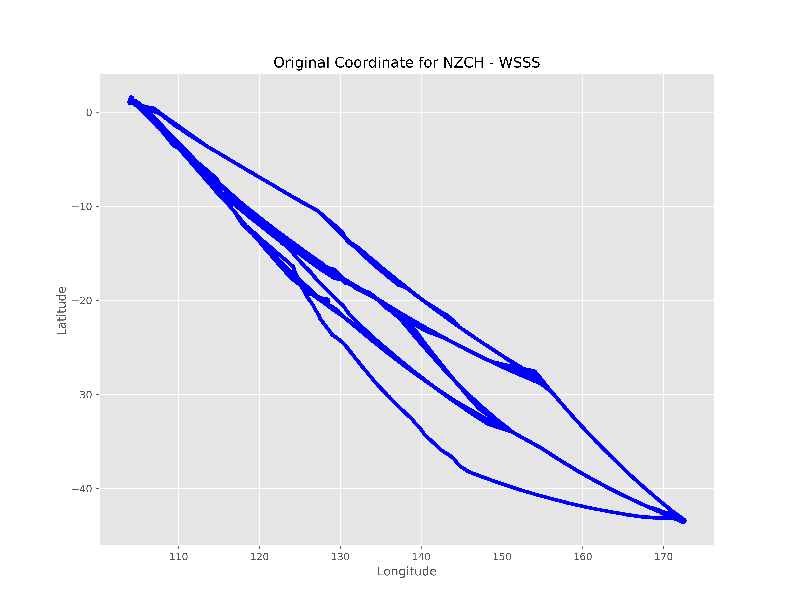
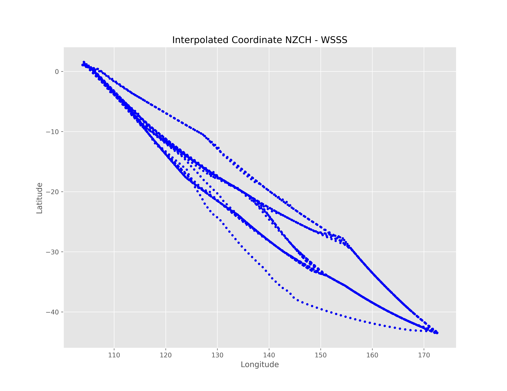
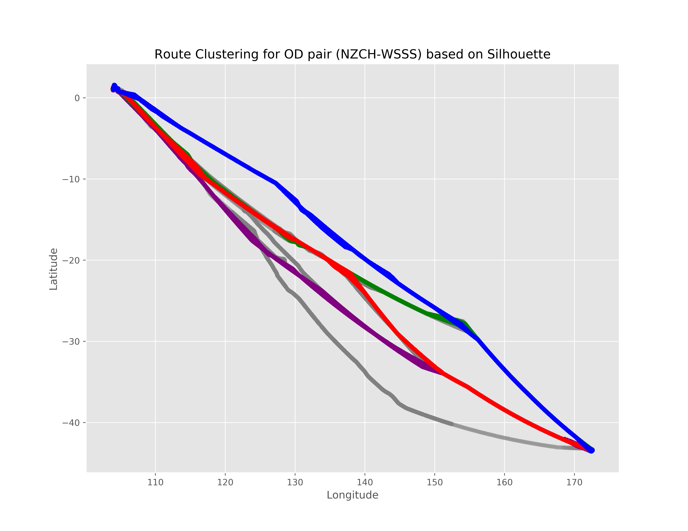
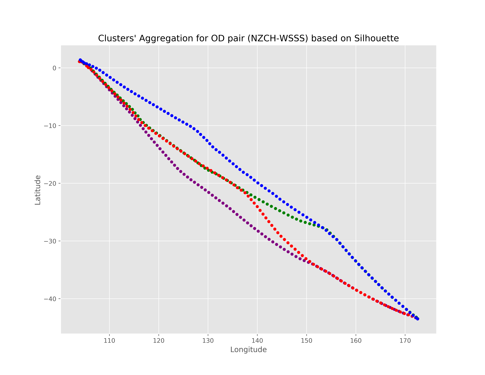

A Simplified Framework for Air Route Clustering Based on ADS-B Data

# INFORMATION
The volume of flight traffic gets increasing over the time, which makes the strategic traffic flow management become one of the challenging problems since it requires a lot of computational resources to model entire traffic data. On the other hand, Automatic Dependent Surveillance - Broadcast (ADS-B) technology has been considered as a promising data technology to provide both flight crews and ground control staff the necessary information safely and efficiently about the position and velocity of the airplanes in a specific area. In the attempt to tackle this problem, we presented in this paper a simplified framework that can support to detect the typical air routes between airports based on ADS-B data. Specifically, the flight traffic will be classified into major groups based on similarity measures, which helps to reduce the number of flight paths between airports. As a matter of fact, our framework can be taken into account to reduce practically the computational cost for air flow optimization and evaluate the operational performance. Finally, in order to illustrate the potential applications of our proposed framework, an experiment was performed using ADS-B traffic flight data of three different pairs of airports. The detected typical routes between each couple of airports show quite good results by virtue of combining two indices for measuring the clustering performance and incorporating human judgment into the visual inspection.

Here's the detailed flow of our framework:



# INSTALLATION
### Install python3

### Install dependencies
```text
matplotlib == 2.0.2
numpy == 1.12.1
pandas == 0.20.1
scikit-learn == 0.19.1
scipy == 1.0.0
six == 1.10.0
```


### Setting environment variable 
Set *PYTHONPATH* to code repos folder. For instance, the code repos folder is `/tmp/atc` the the command should be:

```bash
export PYTHONPATH=$PYTHONPATH:/tmp
```

# USAGE
### Run the application
```bash
python3 single_app.py --flagfile=flags.txt
```

### Configure application's inputs
All the inputs information will be indicated in `flags.txt` file, for instance:
```text
# Data input
--lat_column=Latitude
--lon_column=Longitude
--source_column=Origin
--source_airport=NZCH
--des_airport=WSSS
--des_column=Destination
--time_column=TTravelled
--flight_id_column=Flight_ID

# Storage input
--storage_path=/tmp/atc/ds/result
--flights_data=/tmp/atc/ds/adsb_tracks.csv

# Algorithm input
--num_eps_tuning_value=100
--is_used_frechet=True
--is_plot=True
--is_interpolated=True
--num_points=100

```
Where:
* `lat_column`: Column name of the Track's Latitude
* `lon_column`: Column name of Track's Longitude
* `source_column`: Column name of Source airport
* `source_airport`: Source airport value of the flight
* `des_airport`: Destination airport value of the flight
* `des_column`: Column name of Destination airport
* `time_column`: Column name of time for the flight track
* `flight_id_column`: Column name of flight id
* `storage_path`: Path to folder to store the outcome
* `flights_data`: Full path to the trajectory file
* `num_eps_tuning_value`: Number of eps values for tuning
* `is_used_frechet`: Apply frechet distance for measuring the curves' distance
* `is_plot`: Plot the result or not
* `is_interpolated`: Apply interpolation or not
* `num_points`: Number of interpolated points for each flight

## Quick Installations and Usage
### Clone source code
```bash
git clone git@github.com:quandb/atc.git
```

### All in one script for Ubuntu
```bash
bash atc/run.sh path-to-flagfile
```

# RESULTS
All the outcome of the application can be collecting in the `storage_path` folder as below:
```text
├── flagfile
├── monitor.log
├── NZCH_WSSS
│   ├── NZCH_WSSS_0.79014936063_2clusters_tuning.png
│   ├── NZCH_WSSS_0.803305566728_3clusters_tuning.png
│   ├── NZCH_WSSS_0.853189888954_4clusters_tuning.png
│   ├── NZCH_WSSS_0.910195182631_5clusters_tuning.png
│   ├── NZCH_WSSS_0.929253770189_5clusters_tuning.png
│   ├── NZCH_WSSS_0.934186436572_5clusters_tuning.png
│   ├── NZCH_WSSS_0.937021270234_5clusters_tuning.png
│   ├── NZCH_WSSS_0.938004185317_5clusters_tuning.png
│   ├── NZCH_WSSS_interpolated_coordinates.png
│   ├── NZCH_WSSS_original_coordinates.png
│   ├── NZCH_WSSS_silhouette_0.938004185317_agg.png
│   ├── NZCH_WSSS_silhouette_0.938004185317.png
│   ├── NZCH_WSSS_silhouette_db_1.81884572818_agg.png
│   ├── NZCH_WSSS_silhouette_db_1.81884572818.png
│   ├── NZCH_WSSS_three_indices_2.76082442397_agg.png
│   ├── NZCH_WSSS_three_indices_2.76082442397.png
│   └── tuning_result_for_NZCH_WSSS_SILHOUETTE.csv

```
Where:
* `flagfile`: Show stored the configurations
* `monitor.log`: Store the logs of the app
* `NZCH_WSSS_original_coordinates.png`: Plot the original trajectories

* `NZCH_WSSS_interpolated_coordinates.png`: Plot the interpolated trajectories

* `NZCH_WSSS_silhouette_0.938004185317.png`: Plot the detected clusters

* `NZCH_WSSS_silhouette_0.938004185317_agg.png`: Plot the aggregation of detected clusters

* `tuning_result.*`: store all the values for each parameter for decision support
